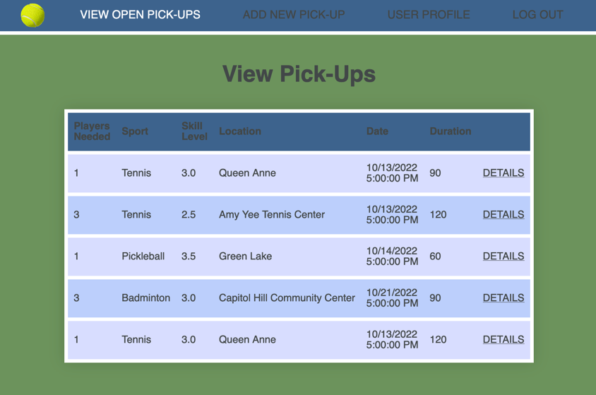
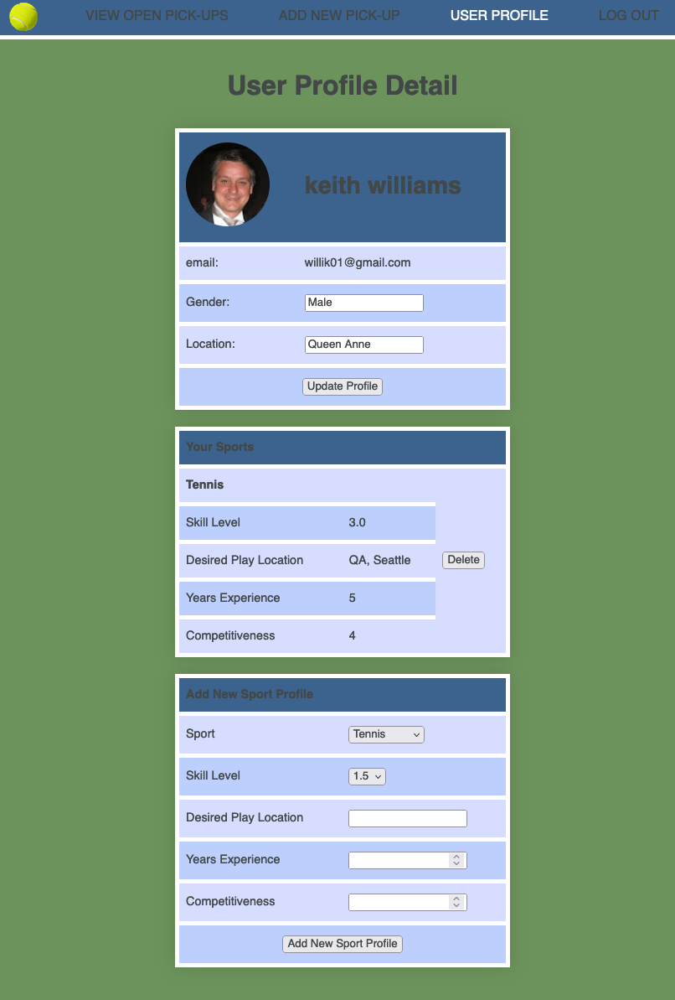
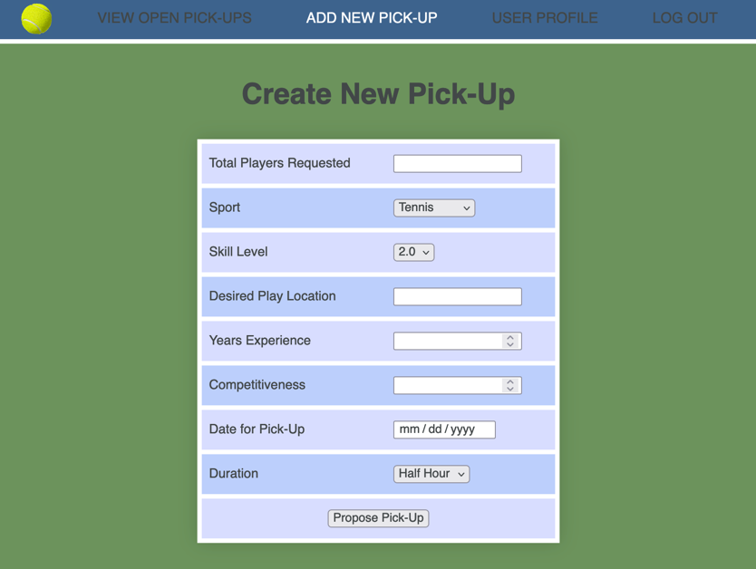

# pick-up-sports
Starting with Tennis, Pickleball and Badminton, this pick-up sports app allows users to propose time & locations to play their sport so that others can find and accept their matches. 

 ## Game Screenshots: 
 

 
 
 

 ## Technologies Used: 
 - HTML
 - CSS
 - JavaScript
 - Node.js
 - Express.js
 - MongoDB/Mongoose
 - EJS templates

  ## Getting Started: 
The home page lists active pick-up proposals. Users can select an existing proposal or create one of their own. Build your Pick-Up profile and provide info on the sports you want to play. 

## Notes
1. It is not yet possible to accept a pick-up request. 

#### Pick-Up Sports
Code
> https://github.com/willik01/pick-up-sports

Live
> https://pick-up-sports.onrender.com/

## Next Steps (Backlog Features):

1. add detail view for outstanding pick-ups
1. ability to accept pick-ups, delete pick-ups, remove yourself from a pick-up
1. Add accepted pickups to your calendar
1. improve data controls to ensure normalized data, ensure users can't accept pick-ups that conflict with ones already accepted

